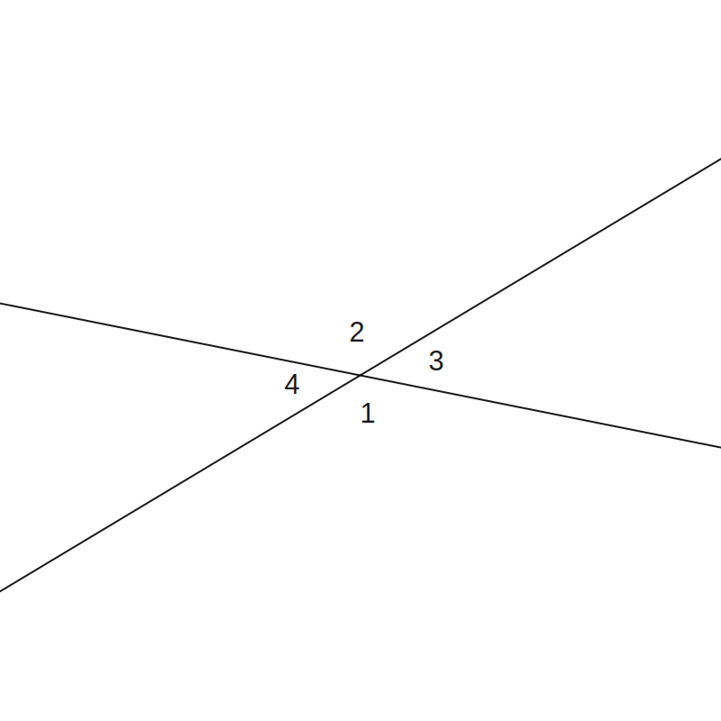
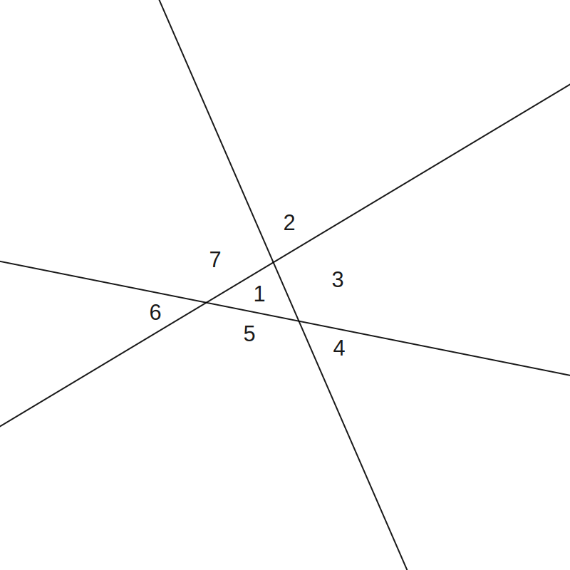

# Part A - Proof Assignment

## Question 1 - Complex Number Proofs

**(a)**
Prove the following identities. These are required proofs for this course.  
Let $z_1 = a + bi = r_1(\cos\theta + i\sin\theta)$
and $z_2 = c + di = r_2(\cos\phi   +  i\sin\phi )$.  
Note: you may wish to write both $z_1$ and $z_2$ in exponential form.

In exponential form:  
$z_1 = r_1e^{i\theta} $  
$z_2 = r_2e^{i\phi}   $

**(a.i)**  $|z_1 z_2| = |z_1||z_2|  $  
$LHS = |r_1e^{i\theta}r_2e^{i\phi}| $  
$= |r_1r_2e^{i(\theta+\phi)}|       $  
$= r_1r_2                           $  
$= |z_1||z_2|                       $  
$= RHS                              $

**(a.ii)** $\arg(z_1z_2) = \arg z_1+\arg z_2$  
$LHS = \arg(r_1e^{i\theta}r_2e^{i\phi})     $  
$= \arg(r_1r_2e^{i(\theta+\phi)})           $  
$= \theta+\phi                              $  
$= RHS                                      $  

**(a.iii)** $\left|\dfrac{z_1}{z_2}\right| = \dfrac{|z_1|}{|z_2|}$

$LHS = \left|\dfrac{r_1e^{i\theta}}{r_2e^{i\phi}} \right|   $

$= \left|\dfrac{r_1}{r_2}e^{i(\theta-\phi)} \right|         $

$= \dfrac{r_1}{r_2}                                         $  
$= RHS                                                      $

**(a.iv)** $\arg\left(\dfrac{z_1}{z_2}\right) = \arg z_1-\arg z_2  $  

$LHS = \arg\left(\dfrac{r_1e^{i\theta}}{r_2e^{i\phi}}\right)       $  

$= \arg\left(\dfrac{r_1}{r_2}e^{i(\theta - \phi)}\right)           $  
$= \theta-\phi  $  
$= RHS          $

**(a.v)** $|z^n_1| = |z_1|^n$  
$LHS = |(r_1e^{i\theta})^n| $  
$= |r_1e^{ni\theta}|        $  
$= r_1^n                    $  
$= RHS                      $  

**(a.vi)** $\arg(z^n_1) = n\arg z_1 $  
$LHS = \arg((r_1e^{i\theta})^n)     $  
$= \arg(r_1e^{in\theta})            $  
$= n\theta                          $  
$= RHS                              $

**(a.vii)** $\overline{z_1} + \overline{z_2} = \overline{z_1+z_2}$  
$LHS = \overline{a+bi} + \overline{c+di}$  
$= a-bi + c-di              $  
$RHS = \overline{a+bi+c+di} $  
$= \overline{a+c+i(b+d)}    $  
$= a+c-i(b+d)               $  
$= a+c-bi-di                $  
$= LHS                      $

**(a.viii)** $\overline{z_1} \times \overline{z_2} = \overline{z_1z_2}$  
$LHS = (a-bi)\times(c-di) $  
$= ac-adi-cbi+bdi^2 $  
$= ac-adi-cbi-bd    $  
$= ac-bd-i(ad+cb)   $  
$RHS = \overline{(a+bi)(c+di)}       $  
$= \overline{ac + adi + cbi + bdi^2} $  
$= \overline{ac- bd + i(ad + cb)}    $  
$= ac - bd - i(ad + cb)              $  
$= LHS                               $

**(a.ix)** $z_1\overline{z_1} = |z_1|^2$  
$LHS = (a+bi)(a-bi)       $
$= a^2-(bi)^2             $  
$= a^2+b^2                $  
$RHS = \left(\sqrt{a^2+b^2}\right)^2 $  
$= a^2+b^2                $  
$= LHS                    $

**(a.x)** $z_1 + \overline{z_1} = 2Re(z)$  
$LHS = a+bi+a-bi $  
$= 2a            $  
$= RHS           $

**(b)**
Prove Euler's formula, that is, $\cos x+i\sin x=e^{ix}$
and hence evalulate $e^{i\pi}$ (known as Euler's identity).  

$f(x)=\dfrac{\cos x+i\sin x}{e^{ix}} $  
$= e^{-i x}(\cos x+i\sin x)          $  
$f'(x)=-ie^{-ix}(\cos x+i\sin x)     $
$+ e^{-ix}(i\cos x-\sin x)           $  
$= -e^{-ix}(i\cos x-\sin x)          $
$+ e^{-ix}(i\cos x-\sin x)           $  
$= 0$  
Therefore $f(x)$ is a constant.  
$f(0) = 1$, meaning that $f(x) = 1$  

Therefore,  
$1 = \dfrac{\cos x+i\sin x}{e^{ix}}$  
$e^{ix} = \cos x+i\sin x$

Hence, $e^{i\pi} = \cos\pi + i\sin\pi = -1$

## Question 2 - Proof Techniques
Using any of the proof techniques we have covered, prove the following statements.  
Clearly state which method you are using.

**(a)** The product of two consecutive even counting numbers is a multiple of 4.  
By direct proof:  
$RTP: 2n(2n + 2) = 4M$, where $n, M \in\mathbb{Z} $  
$LHS = 4n^2 + 4n $  
$= 4(n^2 + n)    $  
$= RHS           $

**(b)** $\forall a,b\in\mathbb{Z}, a^2 = b^2,$ then $a = b$.  
Disprove by counterexample:  
If $a = -x, b = x, x\in\mathbb{Z}$  
Then $a^2 = b^2$ is true, but $a \not= b$  
Therefore the statement is false.

**(c)** There exists a number which is half the sum of its positive factors.  
Proof by example: 6 is such a number.  
$1 + 2 + 3 + 6 = 12$

$\dfrac{12}{2} = 6$

**(d)** The number $\sqrt{5}$ is irrational.  
Proof by contradiction:  
$\sqrt{5} = \dfrac{a}{b}$, where $a, b \in\mathbb{Z}$ and are co-prime.

$5 = \left(\dfrac{a}{b}\right)^2 $  
$5b^2 = a^2                      $  
Therefore, both $a^2$ and $a$ are divisible by 5.  
Let $a = 5k, k \in\mathbb{Z} $  
$5b^2 = (5k)^2               $  
$b^2 = 5k^2                  $  
Therefore $b$ is divisible by 5, which is a contradiction 
as $\dfrac{a}{b}$ is meant to be in simplest form.  
This is a problem because this implies there are an infinite set of decreasing integer pairs
that represent the equivalent fraction, which is impossible, as 1 is the smallest integer.

$\therefore\sqrt{5}$ is irrational by contradiction.

**(e)** Within any group of $n\geq 2$ people, there are at least two people who have met with the same number of people.  
There are a maximum of $n-1$ people to meet, as meeting yourself is not counted.  
And assuming that meeting another person also means they meet you,  
then according to the pigeon-hole principle, this means there will always be at least $2$ people who have met
the same number of people.

Proof by pigeonhole principle:  
The minimum amount of people someone can meet is $0$.
The maximum number of people someone can meet is $n-1$.
If someone meets $0$ people, than the maximum amount of
people that can be met becomes $n-2$.  
Therefore, there is always a maximum of $k-1$ people
to meet from a group of $k$ people.  
Therefore, there will always be at least two people
who meet the same number of people.

## Question 3 - The Triangle Inequality

**(a)** State the triangle inequality both in words and using mathematical symbols.  
The triangle inequality states that for any triangle,
the length sum of any two sides will be greater or equal to that of the third side.

$z \leq x + y$, where $x, y, z$ are the side lengths of a triangle.  

Or: $|x+y|\leq |x| + |y|$, for $x, y \in\mathbb{R}$.

**(b)** Prove the triangle inequality using two different methods. You are encouraged to research this.
Include references to any sources you used.

**Proof 1**, from
[https://math.stackexchange.com/questions/307348/proof-of-triangle-inequality](https://math.stackexchange.com/questions/307348/proof-of-triangle-inequality)

Because  
(1) $x \geq 0 \implies x=|x|$  
(2) $x<0 \implies x<|x|$

Then $x\leq|x|$ and $y\leq|y|$

Case 1:  
$x+y\leq|x|+y\leq |x|+|y|$

Case 2:  
$-x-y\leq|-x|-y\leq|-x| + |-y|$  
$-x-y\leq|x|+|y|$

As $|x+y|$ will always be equal to the maximum of $x+y$ or $-(x+y)$,  
we can say that $LHS = |x+y|$,  
and conclude that $|x+y|\leq|x|+|y|$, as required.

**Proof 2**, from
[https://www.youtube.com/watch?v=lj765RaxreE](https://www.youtube.com/watch?v=lj765RaxreE)  
$RTP: (|x|+|y|)^2 \geq |x+y|^2$  
$LHS = |x|^2 + 2|x||y| + |y|^2$

Because $|a|\geq a, |a|^2 = a^2, a \in\mathbb{R}$,  
$LHS \geq x^2 +2xy + y^2$  
$=(x+y)^2$  
$=|x+y|^2$  
$=RHS$

Therefore, $(|x|+|y|)^2 \geq |x+y|^2$.

Because both sides are $\geq 0$,  
we can conclude that $|x|+|y| \geq |x+y|$, as required.

**(c)** Summarise each of the proofs from **(b)** and highlight the similarities and differences between the two proofs.

Proof 1 is a case analysis that uses the fact that the absolute number must
be bigger or equal, or that $\pm x \leq |\pm x|$. Case 2 is used to show that
the sign of $x, y$ is not relevant, meaning that the absolutes of those values
can be taken to be equivalent. 

Proof 2 squares both sides of the inequality to allow binomial expansion to prove that $LHS = RHS$.

**(d)** Which method do you prefer, and why?

I prefer Proof 2, as it is more algebraically direct, with no need
to account for edge cases such as negatives for $a,b$ in case 2.

## Question 4 - Quadrilateral and Polygon Properties

**(a.i)** Prove that the axis of a kite is the perpendicular bisector of the other diagonal.

Definition of a kite:
A quadrilateral that has 2 pairs of equal-length sides with equal sides adjacent to each other.

(See graph in question **a.ii**)  
Let $E$ be the crossing point of $AC$ and $BD$.

As $AB=CB, AD=CD$, and $BD$ being a common side,  
$△ABD\equiv△CBD$ (SSS triangle congruency)

From the SSS congruency,  
as $\angle{ABD}=\angle{ABE}, \angle{CBD}=\angle{CBE}$,  
and $\angle{ABE}=\angle{CBE}, AB = CB, BE$ being a common side,    
$△ABE\equiv△CBE$ (SSA triangle congruency)  

From the SSA congruency,  
$\angle BEC= \angle BEA$ and $AE=EC$.  
Because the two angles add up to $180\degree$ (a straight line) and are equal,
they are both $90\degree$ (supplementary angles).
Therefore $AC$ is perpendicular to $BD$.  
The bisection is proven by $AE=EC$, as $E$ is the crossing point of the two lines.

Therefore $AC$ bisects, and is perpendicular, to $BD$.

**(a.ii)** Demonstrate this using Geogebra or similar technology.

$AB = BC, AD = CD$  
Here, $AE=EC=2$ on either side of the bisecting $BD$ line.

**(b.i)** Prove, by mathematical induction, 
that the interior angle sum of an *n*-gon is equal to $(n-2) \times 180$ degrees for all integers, $n \geq 3$.

Let $f(n)$ be the angle sum of an $n$-sided polygon:  
$RTP:f(n)=(n-2)\times 180$.

Prove for the first case ($n=3$):  
$LHS = 180\degree$ (angle sum of a triangle)  
$RHS = (3-2)\times 180 = 180\degree$  
$= LHS$

Assume true for $n=k$:  
$f(k)=(k-2)\times 180$

Prove for $n=k+1$:  
$RTP: f(k+1)=(k-1)\times 180$.

Take three consecutive vertices from some $k+1$ sided polygon, and
construct a triangle.

The angle sum of the remaining polygon (the polygon without point $A$) can
be expressed by $f(k)$.  
Therefore we can express the angle sum of this $k+1$ sided polygon as such:  
$f(k+1) = f(k)+f(3)$  
$= (k-2)\times 180 + 180$, from the assumption for $f(k)$.  
$= (k-1) \times 180$  
$= RHS$

Therefore, the angle sum equaling $(n-2)\times 180$ is proven true by induction.

**(b.ii)** Hence prove that the exterior angle sum of an *n*-gon is $360\degree$.

In an *n*-gon, there are $n$ exterior angles.  
As the exterior angle equals $180\degree$ minus the interior angle,
the sum of the exterior angles can be expressed as:  
$180n-(n-2)\times 180$  
$=180n-180n+360$  
$=360\degree$, as required.

**(c)**
Suppose we draw on a plane *n* lines in 'general position', i.e. with no three concurrent and no two parallel.  
Let $S_n$ be the number of regions into which these lines divide the plane.

**(c.i)** By drawing diagrams, find $S_1, S_2, S_3, S_4$ and $S_5$.

  
  
  
  

$S_1 = 2, S_2 = 4, S_3 = 7, S_4 = 11, S_5 = 16$

**(c.ii)** From these results, make a conjecture about a formula for $S_n$.

$S_n = n + S_{n-1}, S_1 = 2$

Also seems to fit $\frac{n^2+n+2}{2}$

**(c.iii)** Prove this formula by mathematical induction.  

We can prove the formula given the recursive definition is true.

The first 5 cases are true:  
$n=1: \frac{1^2+1+2}{2}=2 $  
$n=2: \frac{2^2+2+2}{2}=4 $  
$n=3: \frac{3^2+3+2}{2}=7 $  
$n=4: \frac{4^2+4+2}{2}=11$  
$n=5: \frac{5^2+5+2}{2}=16$

Assume $n = k$ is true:  
$S_k = k + S_{k-1}, S_k = \frac{k^2+k+2}{2}$

Prove true for $n = k+1$:  
$RTP: S_{k+1} = \frac{(k+1)^2+(k+1)+2}{2}$  
$RHS = \frac{k^2+3k+3}{2}$  
$LHS = k+1 + S_k$  
$= k+1 + \frac{k^2+k+2}{2}$  
$= \frac{k^2+k+2+2(k+1)}{2}$  
$= \frac{k^2+3k+3}{2}$  
$= RHS$

Therefore $\frac{n^2+n+2}{2}$ is true by induction,
given that the $S_n$ recursive definition is true.

---

